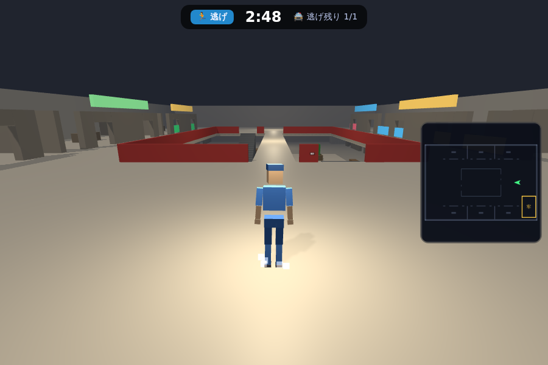

# 👹 ONI RUSH ─ 3Dオンライン鬼ごっこ

スマホでもPCでも遊べる、リアルタイムオンライン対戦の3D鬼ごっこゲーム。
**泥警・氷鬼・代わり鬼** の3ルール、**地下洞窟・ショッピングモール・学校** の3マップ搭載。



## 遊び方

| 操作 | スマホ | PC |
|---|---|---|
| 移動 | 画面**左半分**をドラッグ (仮想スティック) | WASD / 矢印キー |
| ジャンプ | 画面**右半分**をタップ | スペース |
| ダッシュ | 右下の**🏃ボタン**を押している間 | Shift |
| カメラ | 画面右半分をドラッグ | マウスドラッグ |
| 視点切替 | 画面**右上のボタン**で一人称/三人称をいつでも切替 | 同左 |
| 捕まえる (鬼のみ) | **相手に体でタッチするだけ** (自動判定) | 同左 |
| 救出/氷とかし | 拘束された味方に近づくだけ (自動) | 同左 |

- 捕獲は本物の鬼ごっこと同じ**体のタッチ**。鬼の体の中心が相手に触れた瞬間に捕まえられる(エイム不要)。
- 鬼は足がわずかに速い。逃げは地形・高低差・ジャンプ落下ショートカット・**ダッシュ(スタミナ制)**で撒こう。
- 視点はスワイプで自由に動かせるほか、**走っている方向へ自動で追従**する。
- 操作には現実の人間のような**慣性**があり、急な切り返しは一瞬踏ん張りが必要。
- マップ各所の**トランポリン**に飛び乗ると大ジャンプできる。
- 開始5秒は鬼が動けない猶予タイム。

## 🤖 CPU戦

ホーム画面の「**CPUと遊ぶ**」からオフラインでもすぐ対戦できる。

- CPU戦は**専用のCPUレート**で管理され、オンラインのレートとは別物。
- CPUレートが上がると、CPUは足が速くなるのではなく**思考が賢くなる**:
  反応速度・経路探索・先回り・逃げ道の吟味・仲間の救出・牢屋の見張りが段階的に強化される。
- 強さの目安: 🐣みならい鬼 → 👹ふつうの鬼 → 🎯しっかり鬼 → 📚かしこい鬼 → 🧠鬼軍師 → 👺鬼神

## ルール

| モード | タッチされたら | 助け方 | 勝敗 |
|---|---|---|---|
| **泥警** | 牢屋へ送られる | 味方が牢屋の仲間にタッチで復活 | 全員捕まえたら鬼の勝ち / 時間切れで逃げの勝ち |
| **氷鬼** | その場で凍る | 味方がタッチで解凍 | 全員凍ったら鬼の勝ち / 時間切れで逃げの勝ち |
| **代わり鬼** | タッチした人と役割交代 (3秒のタッチバック禁止) | ─ | 時間切れの瞬間に鬼だった人の負け |

## レート

- 全員 **1000** からスタート。
- 1試合での**全プレイヤーのレート増減の合計は必ずゼロ**(ゼロサム方式)。
- 勝敗だけでなく **捕獲数・救出数・解凍数・鬼だった時間** が加点/減点され、「牢屋の仲間を助けまくる」プレイはレートが上がりやすい。
- 高レートほど同じ活躍でも増えにくい補正つき。ホーム画面にトップ10ランキングを表示。

## 部屋とマッチング

- 「部屋を作る」だけで**公開ルーム**としてホーム画面の一覧に出る。2人目以降は一覧をタップするだけで参加(合言葉不要)。
- **非公開ルーム**も作成可能。その場合は**合言葉**を知っている人だけが参加できる。
- ルール・マップ・**鬼の人数(1〜4)**・**制限時間(2〜8分)** は部屋の作成者(ホスト)がロビーで変更でき、ゲーム開始もホストが行う。最大10人。

## マップ (鬼ごっこが楽しくなる間取り設計)

すべてのマップは「**行き止まりゼロ**」で設計。部屋には必ず出入口が2つあり、ぐるぐる回って逃げられる。

- **地下洞窟** ─ 自然にえぐられた**3層構造の迷宮洞窟** (106m四方)。壁・天井・床は箱ではなく**ゴツゴツした岩肌・丸い鍾乳石/石筍・岩柱・転石**で覆われ、本物の洞窟のよう。1層は中央大空洞と4方の大洞窟をつなぐ曲がりくねった坑道網に加え、**マップ外周をぐるりと一周する大回廊**と**四隅の大洞窟・枝洞**を増設(旧境界の行き止まりだった坑道が外側の別世界へ続く)。中層(5m)は外周をめぐる**岩棚回廊**と空洞を見下ろすバルコニー、上層(10m)は**洞窟の上をまたぐ天然の岩橋**と高所テラス。層の間は岩を削った坂道と**飛び降り穴**でつながり、光るキノコに乗れば上の岩棚へジャンプできる。**岩で縁取られた地底湖**(外周にも新設)・骨の牢獄・**群晶のクリスタル**の光も。
- **ショッピングモール** ─ 実際のイオンモールを取材した**「2核1モール」構成** (110m幅・天井高5m)。西の核は**総合スーパー**(陳列棚6列・レジ・冷蔵ケース・バックヤード)、東の核は**2層吹き抜けのフードコート**。間をつなぐメインモール通路には**噴水のある中央吹き抜けコート**とエスカレーター、南北には専門店街(ドラッグストア・100均・アパレル…)とその裏を貫く**スタッフ通路**。さらに南側に**専門店ウイングを増床**─メインモールと5か所でつながる**南プロムナード**沿いに7区画の専門店(家具・スポーツ・書店・家電・雑貨・シューズ…)と**中央イベント広場のステージ**が並び、大きな周回ルートになる。トイレはモール中程の通路奥(イオンあるある)。2Fは書店・ゲームコーナー・レストラン街・衣料品売場。牢屋はバックヤードの警備室。
- **学校** ─ **U字型4階建て校舎** (104m幅・階高4.2m)。1Fに**本棚が並ぶ図書館**、各階のウイングに**トイレ(個室ブース付き)**、両端の**折り返し階段室**で1F〜4F〜屋上まで繋がる。校庭には**体育館**(ステージ・バスケゴール・器具倉庫=牢屋)に加えて**武道場**(畳・神棚・太鼓)・**部室棟**・**自転車置き場**・**倉庫**が並び、路地と隠れ場所だらけ。さらに**校庭を南へ拡張**し、**25mプール**(コースロープ・スタート台・監視台)、**4室の部室棟**(軒下通路つき)、**駐輪場**、自販機・桜並木を増設。中庭には池と桜。

画面右側の**ミニマップ**には現在いるフロアの間取りと**自分の位置だけ**が表示される(敵の位置は見えない)。

---

# 🚀 セットアップ手順

## 1. ローカルで動かす

```bash
npm install
npm start          # → http://localhost:3000
```

これだけで遊べます(レートは `data/ratings.json` に保存)。友達と遊ぶには同じWi-Fi内で `http://<あなたのIP>:3000` を開くか、下のRenderへデプロイ。

## 2. Render にデプロイする(オンライン公開)

Render はこのゲームの **ゲームサーバー(Node.js + Socket.IO)** を動かす場所です。

1. このリポジトリを GitHub に push しておく
2. [render.com](https://render.com) にGitHubアカウントでサインアップ
3. ダッシュボードで **New → Web Service** を選び、このリポジトリを接続
4. リポジトリに `render.yaml` が入っているので設定はほぼ自動。手動の場合は:
   - **Runtime**: Node
   - **Build Command**: `npm install`
   - **Start Command**: `npm start`
   - **Plan**: Free でOK
5. **Create Web Service** を押すと数分で `https://oni-rush-xxxx.onrender.com` が発行される → そのURLを友達に送るだけで一緒に遊べる

> 💡 無料プランは15分アクセスがないとスリープし、次のアクセスで起動に30秒ほどかかります。常時起動したい場合は Starter プラン($7/月)へ。
> 💡 無料プランはディスクが永続化されないため、**レートを残すには次の Supabase 連携が必須**です(未設定でも遊べるが、再デプロイでレートがリセットされる)。

## 3. Supabase を連携する(レートの永続化)

Supabase は **レート・戦績データベース** として使います。

1. [supabase.com](https://supabase.com) にサインアップ → **New project** を作成(無料プランでOK。リージョンは Tokyo 推奨)
2. 左メニューの **SQL Editor** を開き、このリポジトリの `supabase/schema.sql` の中身を貼り付けて **Run**
3. **Project Settings → API** を開き、次の2つをコピー:
   - `Project URL`(例: `https://abcd1234.supabase.co`)
   - `service_role` キー(**secret** の方。anon ではない)
4. Render のダッシュボード → あなたのサービス → **Environment** で環境変数を追加:

   | Key | Value |
   |---|---|
   | `SUPABASE_URL` | Project URL |
   | `SUPABASE_SERVICE_KEY` | service_role キー |

5. **Save Changes** すると自動で再デプロイされ、以後レートは Supabase に保存される

> 🔒 `service_role` キーはサーバー専用の秘密鍵です。**絶対にクライアントコードやGitHubに書かない**でください(このゲームはクライアントからSupabaseに直接アクセスしない設計なので、RLSポリシーの公開設定も不要です)。

ローカル開発でSupabaseを使う場合:

```bash
SUPABASE_URL=https://xxxx.supabase.co SUPABASE_SERVICE_KEY=eyJ... npm start
```

## 4. その他に必要な設定

- **HTTPS**: Render が自動で付与するので設定不要(スマホのタッチ操作・WebSocketもそのまま動く)
- **WebSocket**: Render は素通しなので設定不要。もし Cloudflare 等を前段に置く場合は WebSocket を有効化すること
- **ポート**: サーバーは環境変数 `PORT` を自動で読む(Renderが注入)ので設定不要
- **スケール**: 現構成は1インスタンス前提(部屋はメモリ管理)。大規模化するときは Redis アダプタ + sticky session を導入する

---

# 🛠 技術構成

```
├─ server/            Node.js ゲームサーバー (権威サーバー)
│   ├─ index.js       Express + Socket.IO / 部屋管理 / 3ルールのゲームロジック / 当たり判定
│   ├─ rating.js      ゼロサム・レート計算
│   └─ store.js       Supabase or ローカルJSON への永続化
├─ public/            クライアント (ビルド不要の素のESM)
│   ├─ js/main.js     画面遷移 / ゲームループ / カメラ(一人称・三人称) / 補間
│   ├─ js/humanoid.js 関節付き豆キャラ + 手続きアニメ (歩行・着地・凍結…)
│   ├─ js/collision.js カプセルvsAABB衝突 (段差0.34m自動ステップアップ=階段対応)
│   ├─ js/world.js    マップ→Three.jsシーン構築 (箱に加え円柱/円錐/球/回転に対応・ジオメトリ結合で高速描画)
│   ├─ js/minimap.js  現在フロアの間取り+自分だけ表示
│   ├─ js/vfx.js      パーティクル / 弾道トレーサー / リング波
│   ├─ js/sfx.js      WebAudioで全効果音を合成 (音声ファイル不要)
│   └─ shared/mapdata.js  3マップの間取りデータ (サーバーと共有)
├─ supabase/schema.sql
└─ render.yaml        Render 1クリックデプロイ定義
```

- 位置同期: クライアント20Hz送信 → サーバーが15Hzスナップショット配信 → 受信側は130ms遅延の補間再生
- 当たり判定(捕獲タッチ・救出)はサーバー側で距離検証するのでチート耐性あり
- タイマー・勝敗判定・レート計算もすべてサーバー権威
